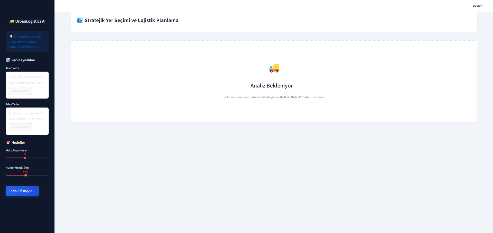
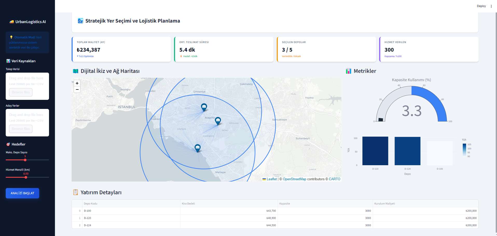

# 🏙️ UrbanLogistics AI: Strategic Dark Store Location Optimization


**A Decision Support System (DSS) for optimizing last-mile delivery networks using Mixed Integer Linear Programming (MILP).**

---

## 🚀 Project Overview

**UrbanLogistics AI** is an analytical tool designed to solve the **Capacitated Facility Location Problem (CFLP)** for quick-commerce (q-commerce) companies. It helps strategic decision-makers minimize operational costs while maximizing customer coverage.

Unlike simple distance-based heuristics, this project uses a mathematical optimization engine (**PuLP**) to determine:
1.  **Where** to open "Dark Stores" among candidate locations.
2.  **Which** customers should be assigned to which depot.
3.  **How** to balance capacity constraints and service level agreements (SLA).


## 📺 Project Visuals

### 1. Main Dashboard


### 2. Executive and Network Topology


---

## 💼 Business Problem

In the competitive landscape of quick commerce (e.g., Getir, Gopuff, Gorillas), **logistics costs** and **delivery speed** are the key differentiators.
*   **Challenge:** Opening too many depots increases CAPEX and OPEX (Rent). Opening too few leads to long delivery times and customer churn.
*   **Goal:** Find the "sweet spot" that minimizes total cost (Rent + Transportation) while ensuring delivery times are under a specific threshold (e.g., <15 mins).

---

## ⚙️ Solution Approach 

This project bridges **Data Science** and **Industrial Engineering**:

1.  **Synthetic Data Generation:** Simulates realistic customer clusters (Gaussian Blobs) and candidate sites with variable rent costs based on city center proximity.
2.  **Mathematical Modeling (MILP):**
    *   **Objective Function:** Minimize $Z = \sum (Fixed Costs) + \sum (Variable Transportation Costs)$.
    *   **Constraints:**
        *   Capacity Constraints (Depots cannot exceed max daily orders).
        *   Assignment Constraints (Each customer assigned to exactly one depot).
        *   Service Range Constraints (Max distance e.g., 8km).
        *   Budget Constraints (Max number of depots).
3.  **Visualization:** Interactive "Spider Maps" to visualize the supply chain network and KPI dashboards for financial impact analysis.

---

## 🛠️ Tech Stack

*   **Language:** Python
*   **Optimization:** PuLP (Linear Programming Solver)
*   **Web Framework:** Streamlit
*   **Geospatial Analysis:** Folium, Geopy
*   **Visualization:** Plotly Express, Plotly Graph Objects
*   **Data Manipulation:** Pandas, NumPy

---

## 💻 How to Run Locally

1.  **Clone the repository**
    ```bash
    git clone https://github.com/Farslan-x/UrbanLogistics-AI.git
    cd UrbanLogistics-AI
    ```

2.  **Create a Virtual Environment (Optional but recommended)**
    ```bash
    python -m venv venv
    # Windows
    venv\Scripts\activate
    # Mac/Linux
    source venv/bin/activate
    ```

3.  **Install Dependencies**
    ```bash
    pip install -r requirements.txt
    ```

4.  **Run the App**
    ```bash
    streamlit run app.py
    ```

---

## 📊 Future Improvements

*   Integration with real-world traffic data (OSRM / Google Maps API).
*   Demand forecasting module using Time Series Analysis (ARIMA/Prophet).
*   Multi-objective optimization (minimizing CO2 emissions).

---